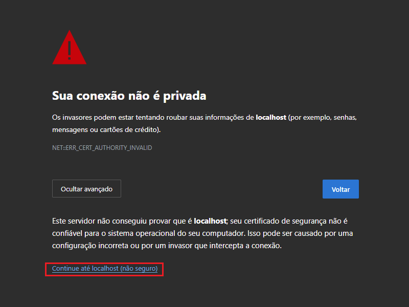

# Problemas com Certificado Inválido

Você verá uma mensagem igual à mostrada abaixo quando usamos os certificados _`key.pem`_, _`cert.pem`_ que vem junto ao repositorio:



Isso acontece pois o certificado gerado, foi atrelado ao usuário. Mas não se preocupe, você pode clicar em avançado no browser e prosseguir para à aplicação.

## Mas você pode também gerar sua própria chave _se necessário_.

1.  Para gerar sua própria chave você precisa:

    - Instalar o [MKCert](https://github.com/FiloSottile/mkcert)

2.  Colocar seu usuario como usuário válido para certificado:

    - ```sh
      mkcert -install
      ```

3.  Gerar a Key e o Cert:

    - ```sh
      mkcert -key-file key.pem -cert-file cert.pem 0.0.0.0 localhost 127.0.0.1 ::1
      ```
